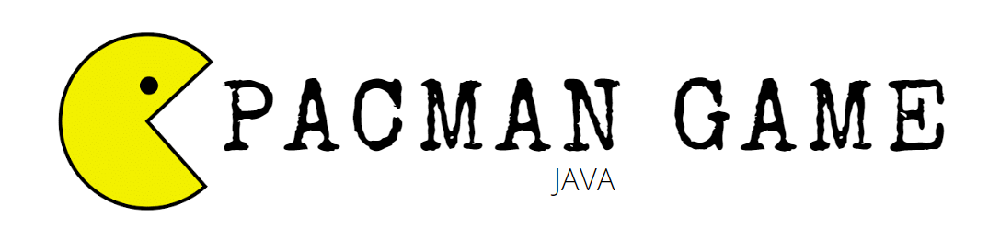
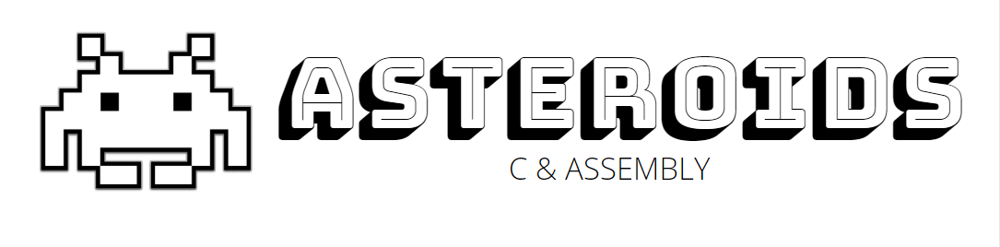
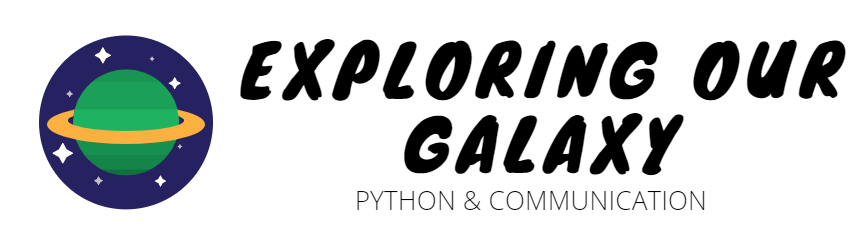
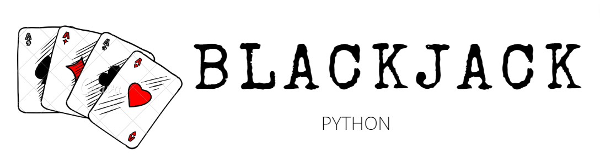
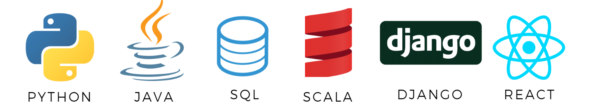
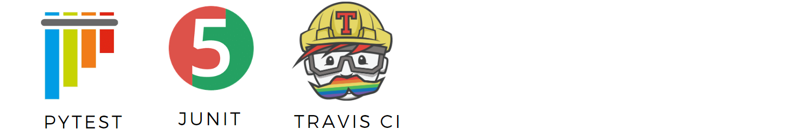
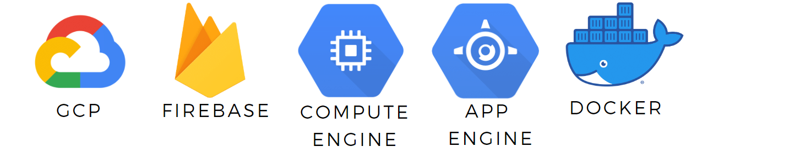
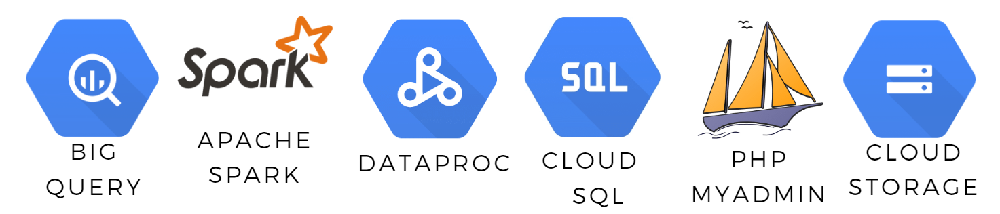

# **ABOUT ME**

>Hi! My name is Tean and while I may not meet all your tick boxes now, I will. I am a current Computer Science student and Business Management graduate with a passion for collaborating and problem solving to find the best solutions for a better future.

**I love a challenge.** 

When I started at STA Travel I had no idea how to be a travel agent, but after just 9 months I was promoted to Store Manager after being named top travel agent in Queensland for 2017. 

**I am self-motivated.**

In addition to my university studies, I have learnt how to use git effectively, github pages, create pypi packages, pytest and TravisCI through online resources. 

**I have a passion for learning.**

While other teams completed their cloud web applications, I built Shared World individually with Django and React with no prior knowledge and was awarded ‘Best Use of Cloud’ for my cohort.

### Work Experience

**STA Travel / Store Manager & Travel Expert / 2017 - 2018**

_Awards: Qld Top Travel Agent– Q4 2017, Qld Top Tour Seller 2018, Qld Top Rail Seller 2018_

- Oversee management of the all store bookings with an acute attention to detail to ensure accuracy and timely correspondence with both customers and suppliers at every stage of the booking process
- Identify individual strengths and weaknesses of a team of five in-store travel agents to maximise sale conversion, ensure individual success and consistently reach individual and team targets
- Continuously demonstrate professionalism and intricate problem solving to ensure customer satisfaction as the highest point of contact for all customer complaints prior to departure, with no complaints recorded throughout my employment
- After being name top travel agent, amongst other awards, for Queensland I was promoted to Store Manager in just 9 months
Demonstrated advanced skills in Global Distribution System (Amadeus) and various travel management programs

**Starlane Entertainment / Executive Assistant / 2016 - 2017**
- Demonstrate use of advanced Microsoft Word features to edit and format multiple self-published novels for e-book and physical distribution for Amazon and several other platforms
- Performing market research  to design and customize a personal business WordPress webpage and create content for social media to increase web traffic by 15%

# **PROJECTS**

_BigQuery, Dataproc, Cloud SQL, Cloud Storage, Django, React, Scala, Apache Spark_

A cloud application solution for overtourism and promoting responsible travel by providing a platform where travellers explore destinations using a map displaying tourist-to-local ratios and view blogs filtered by their interests. It is a platform where responsible, conscientious travellers can be made. 

This project was the assessment item for **Cloud Computing** (INFS3208) at University of Queensland. The [proposal](https://teanlouise.github.io/shared-world/proposal) was submitted as assignment 1 and this implementation as assignment 2. Both assessment pieces recieved full marks. In addition the project was nominated for the best project award and was awarded the 'Best Use of Cloud' for the cohort (62 projects submitted). A live and recorded explanation, including demonstration of the project was given.  

[**READ MORE**](https://teanlouise.github.io/shared-world) 

This version of the traditional 'Pacman' game was implemented over the course of three assignments for **Programming in the Large** (CSSE2002) at University of Queensland. The overall goal of the project was to gain confidence with writing, reading and testing code in Java that expands multiple classes. The marking criteria was according to correct functionality (55%), code review (25%) and successful tests (20%). Each assignment received a high distinction.

[**READ MORE**](https://teanlouise.github.io/Pacman-Game/)

Using basic C with Atmel Studio, a “Space Invaders” game was modified to allow push button and keyboard interaction, hit detection, speed variation and scoring on a LED matrix, seven segment display and serial terminal (puTTY). This was submitted as the project for **Introduction to Computer Systems** (CSSE2010) in which I also had the opportunity to complete projects focused on logic diagrams, logic gate design and constructing logic circuits using a breadboard. 

[**READ MORE**](https://teanlouise.github.io/Asteroids/)

Using Python, I developed a travel destination recommendation program demonstrating the use of control structures and functional decomposition. It was submitted as Assignment 1 for **Introduction to Software Engineering** (CSSE1001) at University of Queensland. Software design choices and documentation were a key aspect of the grading criteria. This assessment received a High Distinction, and all feedback has been applied in this solution.

[**READ MORE**](https://teanlouise.github.io/Travel-Inspiration/)

An interactive space exhibit for a musuem was designed using basic python skills, and communicated to both science rookies and enthusiasts. This project was submitted as the Python and Communication Assignment for **Theory & Practice in Science** (SCIE1000) at the University of Queensland. The project received full marks. Understanding of mathematical modelling, using python at basic level, commenting to a high standard and communicating effectively to the audiences were the key marking criteria.

[**READ MORE**](https://teanlouise.github.io/Exploring-Our-Galaxy/)

A simple blackjack game. This was completed as the milestone 2 project for Jose Portilla's "Zero-to-Hero Python" course. Basic Python functionality inlcuding Object-Oriented programming practices were used to implement this project. Multiple tests were written in pytest and setup for automatic testing with **Travis CI**.

[**READ MORE**](https://teanlouise.github.io/Blackjack/)

This package has functionality for different types of distribution frameworks. There is currently has functionality for Binomial and Guassian distributions. Uploaded on **pypi.org** as part of an exercise for Udacity Machine Learning Engineer Nanodegree Program (Part 1).

[**READ MORE**](https://teanlouise.github.io/Distributions-Package/)

A simple tic-tac-toe game. This was completed as the milestone 1 project for Jose Portilla's "Zero-to-Hero Python" course. This is the first project completed in Python. Use basic functional structure.

[**READ MORE**](https://teanlouise.github.io/Tic-Tac-Toe/)

# **SKILLS**

**Languages**

**Testing and Validation**

**Cloud Deployment**

**Data Management**

**Code Editor**

